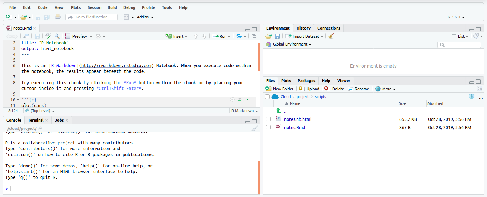
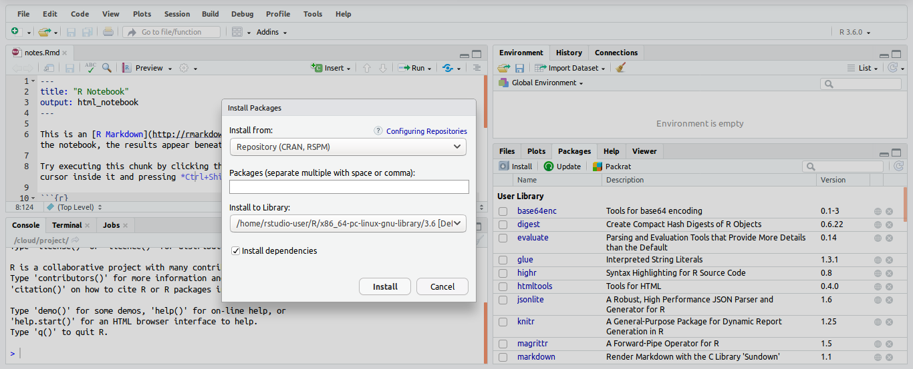
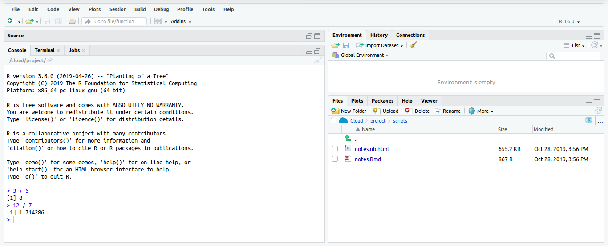

#### What is Data Science?

It is a multidisciplinary blend of science, programming and data analysis.

---

#### Why Data Science?

- It's in demand.
- There are abundant positions.
- Data science makes data better.
- I is a highly paid career.

---

#### Why R as programming language?

- It is friendly for new users.
- It has a big community.
- It is useful for scalable data.
- It provides professional oportunities.

---

#### What are we going to learn?

- R programming bases.
- Statistics bases.
- Bases in writing scientific articles.

[R](https://www.r-project.org/) is used to refer to both the programming language and the software that interpretets the scripts written using it.

[Rstudio](https://rstudio.com/) is currently a very popular way to interact with the R software. It is the most popular integrated development interface for R.

---

### Concepts

#### Create a new project

Create a new file where we will type our scripts. Go to File > New File > R Notebook.



In addition, there are in excess of [10,000 additional packages](https://cran.r-project.org/) which can be used to extend the functionality of [R](https://rstudio.com/products/rpackages/).



You can get output from R simply by typing math in the console:

**Input:**

```r
4 + 5
```

**Output:**

```r
[1] 9
```



However, to do useful and interesting things, we need to assign values to objects. To create an object, we need to give it a name followed by the assignment operator `<-`:

**Input:**

```r
a <- 1.0
```

#### Some useful functions

It is a block of organized, and reusable code that is used to perform a single, related action. An example of a function call is:

**Input:**

```r
b <- sqrt(a)
```

**Output:**

```r
[1] 1
```

the `sqrt()` function calculates the square root of the value in parenthesis.

Let’s try a function that can take multiple arguments:

**Input:**

```r
round(3.141592)
```

**Ouput:**

```r
[1] 3
```

and it has returned the value 3. That’s because the default is to round to the nearest whole number.

If we want more digits we can write in the `round()` function the next:

**Input:**

```r
round(3.141592, digits=2)
```

**Outpu:**

```r
[1] 3.14
```

#### How to create vectors?

A vector is the most common and basic data type in R. A vector is composed by a series of values, which can be either numbers or characters. We can assign a series of values to a vector using the `c()` function.

**Input:**

```r
vector <- c(1, 2, 3, 4, 5)
```

To know the content of a vector, there is a function named `length()`, it tells you how many elements are in a vector.

**Input:**

```r
length(vector)
```

**Ouput:**

```r
[1] 5
```

To know the type of element, there is a function named `class()`:

**Input:**

```r
class(vector)
```

**Output:**

```r
[1] "numeric"
```
