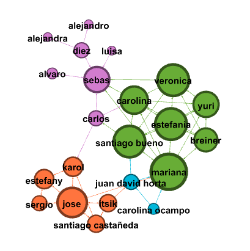
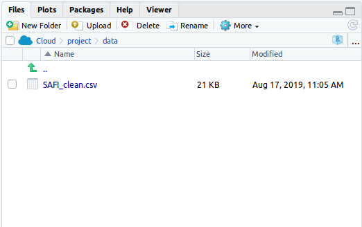

In the first part of the class, you are going to create a dataset with the connections that you have in an specific. This was an example in our course:

<div class="markdown-div-tables">
    <table>
        <thead>
            <tr>
                <td>source</td>
                <td>target</td>
            </tr>
        </thead>
        <tbody>
            <tr>
                <td>diez</td>
                <td>alejandra</td>
            </tr>
            <tr>
                <td>diez</td>
                <td>alejandro</td>
            </tr>
            <tr>
                <td>sebas</td>
                <td>alvaro</td>
            </tr>
            <tr>
                <td>estefania</td>
                <td>breiner</td>
            </tr>
            <tr>
                <td>mariana</td>
                <td>breiner</td>
            </tr>
            <tr>
                <td>veronica</td>
                <td>breiner</td>
            </tr>
            <tr>
                <td>santiago bueno</td>
                <td>carlos</td>
            </tr>
            <tr>
                <td>breiner</td>
                <td>carolina</td>
            </tr>
            <tr>
                <td>carlos</td>
                <td>carolina</td>
            </tr>
            <tr>
                <td>estefania</td>
                <td>carolina</td>
            </tr>
            <tr>
                <td>santiago bueno</td>
                <td>carolina</td>
            </tr>
            <tr>
                <td>mariana</td>
                <td>carolina</td>
            </tr>
            <tr>
                <td>veronica</td>
                <td>carolina</td>
            </tr>
            <tr>
                <td>sebas</td>
                <td>diez</td>
            </tr>
            <tr>
                <td>breiner</td>
                <td>estefania</td>
            </tr>
            <tr>
                <td>carolina</td>
                <td>estefania</td>
            </tr>
            <tr>
                <td>mariana</td>
                <td>estefania</td>
            </tr>
            <tr>
                <td>santiago bueno</td>
                <td>estefania</td>
            </tr>
            <tr>
                <td>veronica</td>
                <td>estefania</td>
            </tr>
            <tr>
                <td>yuri</td>
                <td>estefania</td>
            </tr>
            <tr>
                <td>jose</td>
                <td>estefany</td>
            </tr>
            <tr>
                <td>karol</td>
                <td>estefany</td>
            </tr>
            <tr>
                <td>sergio</td>
                <td>estefany</td>
            </tr>
            <tr>
                <td>jose</td>
                <td>itsik</td>
            </tr>
            <tr>
                <td>santiago castañeda</td>
                <td>itsik</td>
            </tr>
            <tr>
                <td>estefany</td>
                <td>jose</td>
            </tr>
            <tr>
                <td>itsik</td>
                <td>jose</td>
            </tr>
            <tr>
                <td>karol</td>
                <td>jose</td>
            </tr>
            <tr>
                <td>santiago castañeda</td>
                <td>jose</td>
            </tr>
            <tr>
                <td>sergio</td>
                <td>jose</td>
            </tr>
            <tr>
                <td>caro</td>
                <td>juan david</td>
            </tr>
            <tr>
                <td>itsik</td>
                <td>juan david</td>
            </tr>
            <tr>
                <td>carlos</td>
                <td>karol</td>
            </tr>
            <tr>
                <td>estefany</td>
                <td>karol</td>
            </tr>
            <tr>
                <td>jose</td>
                <td>karol</td>
            </tr>
            <tr>
                <td>santiago</td>
                <td>karol</td>
            </tr>
            <tr>
                <td>breiner</td>
                <td>mariana</td>
            </tr>
            <tr>
                <td>carolina ocampo</td>
                <td>mariana</td>
            </tr>
            <tr>
                <td>estefania</td>
                <td>mariana</td>
            </tr>
            <tr>
                <td>jose</td>
                <td>mariana</td>
            </tr>
            <tr>
                <td>juan david horta</td>
                <td>mariana</td>
            </tr>
            <tr>
                <td>santiago bueno</td>
                <td>mariana</td>
            </tr>
            <tr>
                <td>veronica</td>
                <td>mariana</td>
            </tr>
            <tr>
                <td>carolina</td>
                <td>santiago bueno</td>
            </tr>
            <tr>
                <td>estefania</td>
                <td>santiago bueno</td>
            </tr>
            <tr>
                <td>juan david horta</td>
                <td>santiago bueno</td>
            </tr>
            <tr>
                <td>mariana</td>
                <td>santiago bueno</td>
            </tr>
            <tr>
                <td>veronica</td>
                <td>santiago bueno</td>
            </tr>
            <tr>
                <td>yuri</td>
                <td>santiago bueno</td>
            </tr>
            <tr>
                <td>itsik</td>
                <td>santiago</td>
            </tr>
            <tr>
                <td>jose</td>
                <td>santiago</td>
            </tr>
            <tr>
                <td>alvaro</td>
                <td>sebas</td>
            </tr>
            <tr>
                <td>carlos</td>
                <td>sebas</td>
            </tr>
            <tr>
                <td>carolina</td>
                <td>sebas</td>
            </tr>
            <tr>
                <td>diez</td>
                <td>sebas</td>
            </tr>
            <tr>
                <td>luisa</td>
                <td>sebas</td>
            </tr>
            <tr>
                <td>mariana</td>
                <td>sebas</td>
            </tr>
            <tr>
                <td>veronica</td>
                <td>sebas</td>
            </tr>
            <tr>
                <td>estefany</td>
                <td>sergio</td>
            </tr>
            <tr>
                <td>jose</td>
                <td>sergio</td>
            </tr>
            <tr>
                <td>breiner</td>
                <td>veronica</td>
            </tr>
            <tr>
                <td>estefania</td>
                <td>veronica</td>
            </tr>
            <tr>
                <td>mariana</td>
                <td>veronica</td>
            </tr>
            <tr>
                <td>santiago bueno</td>
                <td>veronica</td>
            </tr>
            <tr>
                <td>yuri</td>
                <td>veronica</td>
            </tr>
            <tr>
                <td>breiner</td>
                <td>yuri</td>
            </tr>
            <tr>
                <td>carolina</td>
                <td>yuri</td>
            </tr>
            <tr>
                <td>estefania</td>
                <td>yuri</td>
            </tr>
            <tr>
                <td>mariana</td>
                <td>yuri</td>
            </tr>
            <tr>
                <td>santiago bueno</td>
                <td>yuri</td>
            </tr>
            <tr>
                <td>veronica</td>
                <td>yuri</td>
            </tr>
        </tbody>
    </table>
</div>

With the program [Gephi](https://gephi.org/) we create a graph of the information above:



It was useful to understand some statistical models, like directed graph and undirected graph.

In the second part of the class we analyse a dataset. [Here you can download the dataset](https://figshare.com/articles/SAFI_Survey_Results/6262019). The one that we are going to use is named **SAFI_clean.csv**.

After download the dataset, we are going to create a folder in RStudio cloud named data, and we are going to save there the dataset.



## Let's start...

The first thing that we have to do is download two packages named tidyverse and bibliometrix.

**Input:**

```r
library(tidyverse)
library(bibliometrix)
```

Now, we can load the dataset in the program:

**Input:**

```r
interviews <- read_csv('/cloud/project/data/SAFI_clean.csv', na='NULL')
```

**Output:**

```
Parsed with column specification:
cols(
  key_ID = col_double(),
  village = col_character(),
  interview_date = col_datetime(format = ""),
  no_membrs = col_double(),
  years_liv = col_double(),
  respondent_wall_type = col_character(),
  rooms = col_double(),
  memb_assoc = col_character(),
  affect_conflicts = col_character(),
  liv_count = col_double(),
  items_owned = col_character(),
  no_meals = col_double(),
  months_lack_food = col_character(),
  instanceID = col_character()
)
```

# **To be continued...**
