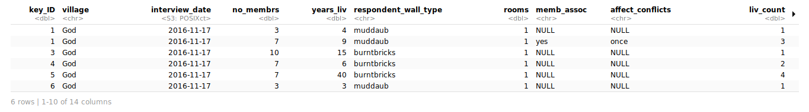
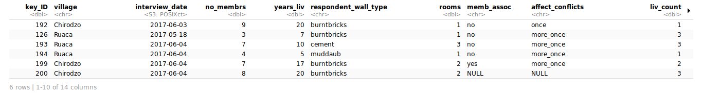
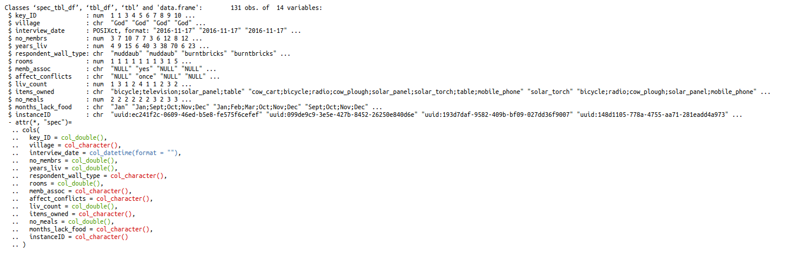
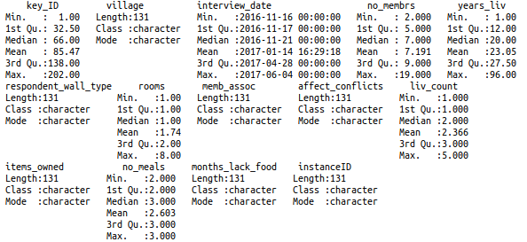
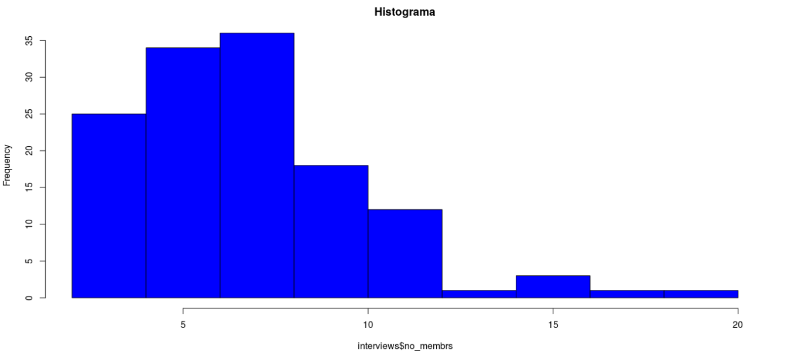
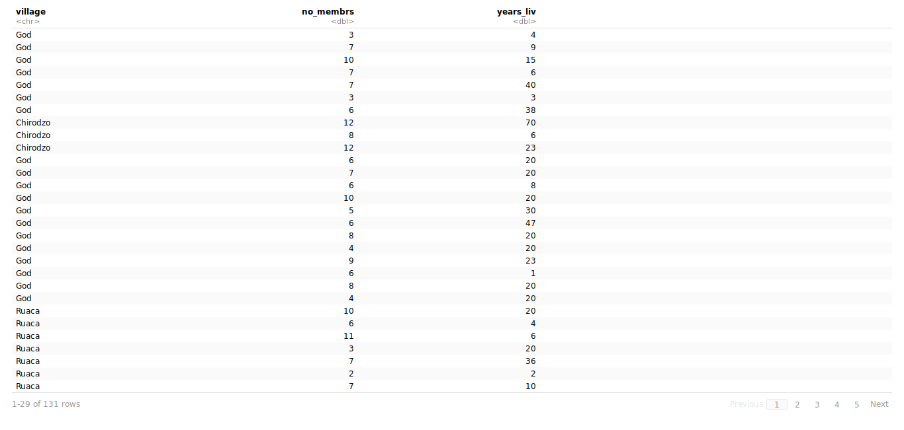
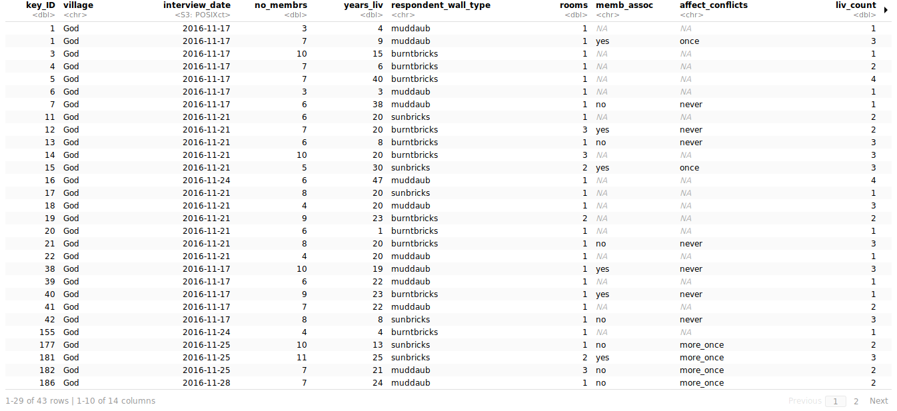
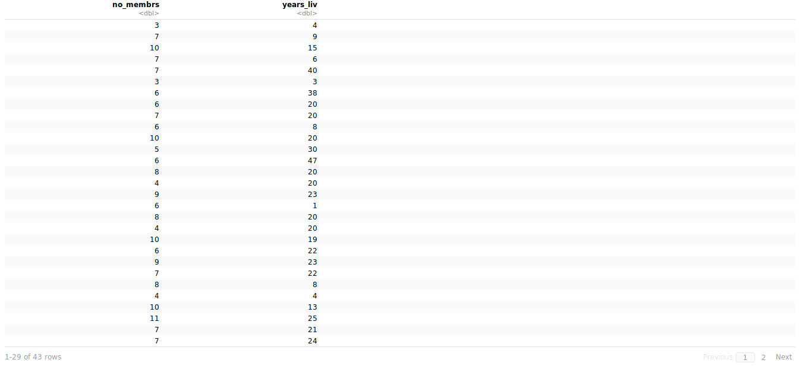
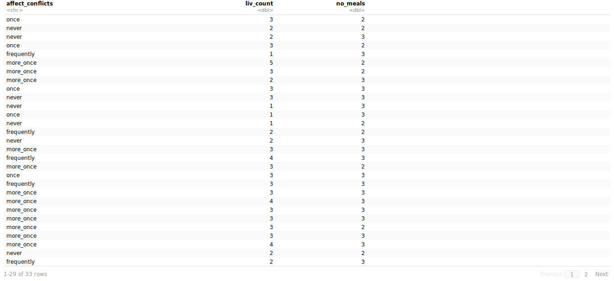

We are going to start with a descriptive analysis of the dataset of the previous class.

### Descriptive analysis

First to know the dimension of the data use the function `dim()`:

**Input:**

```r
dim(interviews)
```

**Output:**

```r
[1] 131  14
```

If you want to know just the number of rows of the dataset, you could use the function `nrow()`. On the other hand, if you want to know just the number of columns of the dataset, you could use the function `ncol()`:

**Input:**

```r
nrow(interviews)
```

**Output:**

```r
[1] 131
```

**Input:**

```r
ncol(interviews)
```

**Output:**

```r
[1] 14
```

If you want to see just the first six rows of the dataset, you could use the function `head()`:

**Input:**

```r
head(interviews)
```

**Output:**



If you want to see just the last six rows of the dataset, you could use the function `tail()`:

**Input:**

```r
tail(interviews)
```

**Output:**



If you want to see the type of element of each variable in the dataset, you could use the function `str()`:

**Input:**

```r
str(interviews)
```

**Output:**



If you want to see a summary of the rows of each column of the dataset, you could use the function `summary()`:

**Input:**

```r
summary(interviews)
```

**Output:**



Now, we are going to check some variables respect other:

**Input:**

```r
hist(interviews$no_membrs,
     main='Histograma',
     col="blue")
```

**Output:**



In this part, we are going to use some functions of [Tidyverse](https://www.tidyverse.org/).

If you want to choose some variables of the dataset, you could use the function `select()`:

**Input:**

```r
select(interviews, village, no_membrs, years_liv)
```

**Output:**



If you want to choose rows where conditions are true of the dataset, you could use the function `filter()`:

**Input:**

```r
filter(interviews, village == 'God')
```

**Output:**



### Pipes

For this exercise, from the **interviews** dataset, we are going to choose from the column **village** the ones that belong to **God**. Also, we are going to **select** the columns **no_membrs** and **years_liv**.

**Input:**

```r
interviews_God <- interviews %>%
  filter(village == 'God') %>%
  select(no_membrs, years_liv)
interviews_God
```

**Output:**



For this exercise, from the **interviews** dataset, we are going to choose from the column **memb_assoc**, i.e. in each row it has to say **yes**. Also, we are going to **select** the columns **affect_conflicts**, **liv_count** and **no_meals**.

**Input:**

```r
exercise <- interviews %>%
  filter(memb_assoc == 'yes') %>%
  select(affect_conflicts, liv_count, no_meals)
exercise
```

**Output:**



Another useful function of tidyverse is `mutate()`:

**Input:**

```r
interviews %>%
  mutate(people_per_room = no_membrs / rooms)
```

**Output:**


