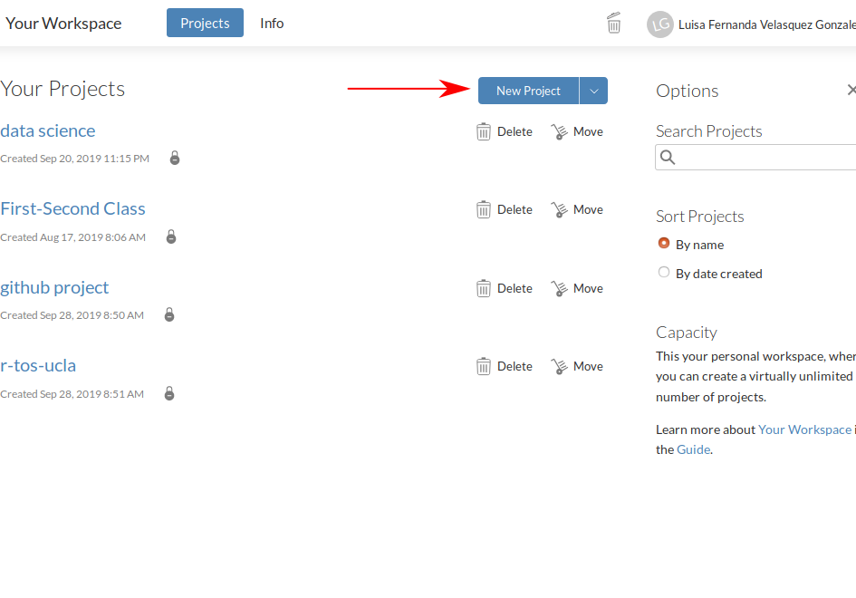
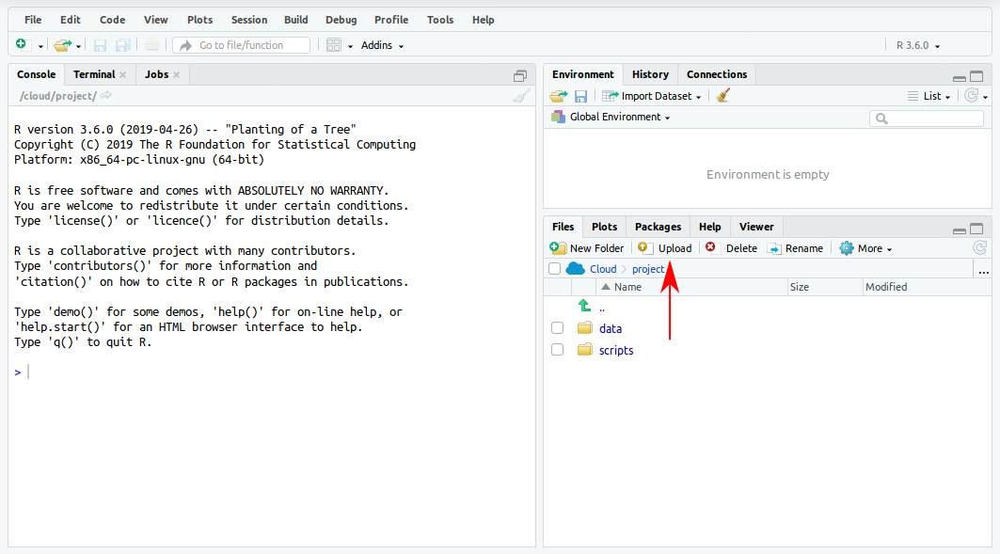
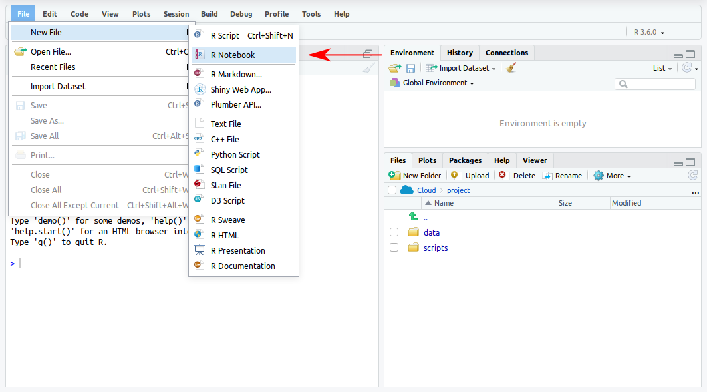
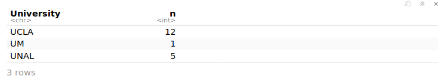
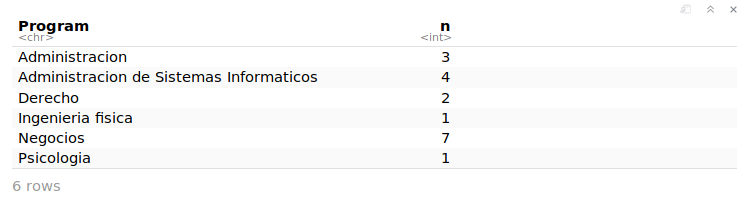
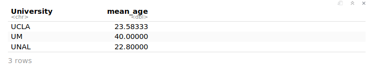
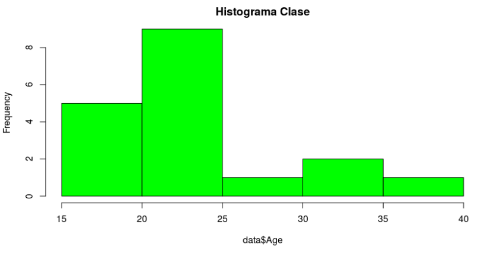
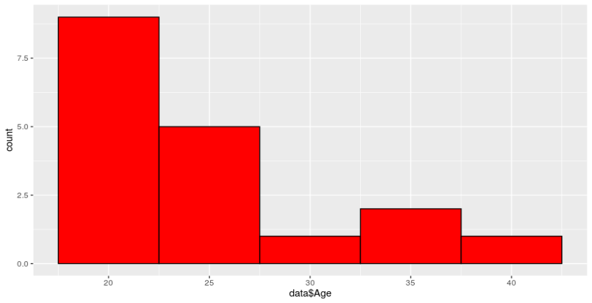
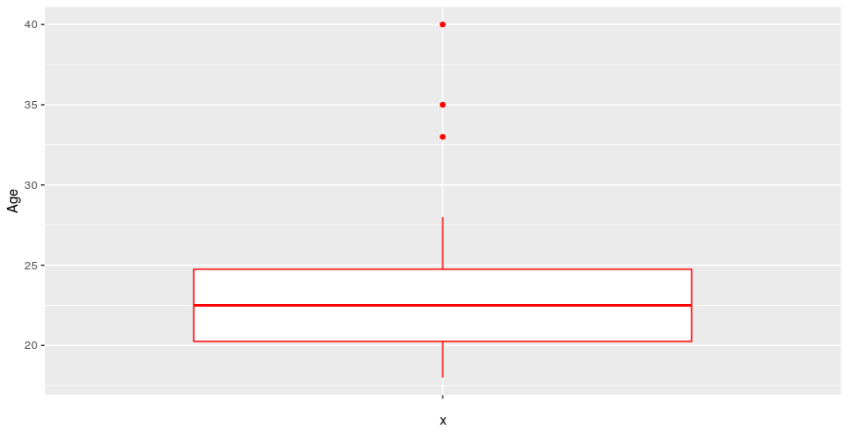
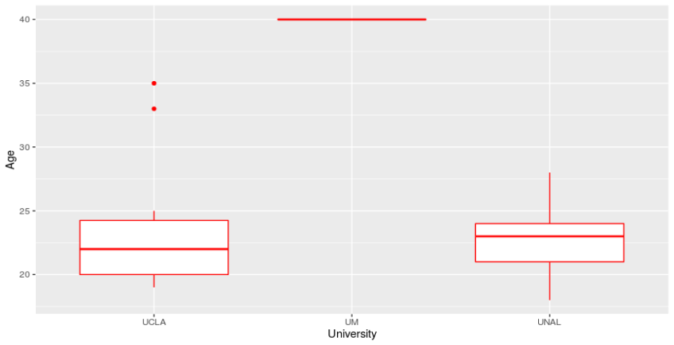

In order to analyze the data, we have to follow the steps bellow.

In R Studio Cloud, start a new project giving it the name of preference.



Upload the CSV dataset named [clase_raw.csv](files/clase_raw.csv) in the folder data.



The dataset has the following appearance

<div class="markdown-div-tables">
    <table>
        <thead>
            <tr>
                <td>Name</td>
                <td>University</td>
                <td>Program</td>
                <td>Gender</td>
                <td>Age</td>
                <td>Neighborhood</td>
                <td>Grade_point_average</td>
                <td>no_per_house</td>
                <td>Relationship?</td>
                <td>Pet?</td>
                <td>Semester</td>
            </tr>
        </thead>
        <tbody>
            <tr>
                <td>Person 1</td>
                <td>UNAL</td>
                <td>Administracion de Sistemas Informaticos</td>
                <td>Masculino</td>
                <td>23</td>
                <td>Minitas</td>
                <td>3.8</td>
                <td>5</td>
                <td>SI</td>
                <td>SI</td>
                <td>8</td>
            </tr>
            <tr>
                <td>Person 2</td>
                <td>UCLA</td>
                <td>Psicologia</td>
                <td>Masculino</td>
                <td>33</td>
                <td>Chipre</td>
                <td>4.4</td>
                <td>3</td>
                <td>NO</td>
                <td>NO</td>
                <td>4</td>
            </tr>
            <tr>
                <td>Person 3</td>
                <td>UCLA</td>
                <td>Derecho</td>
                <td>Masculino</td>
                <td>19</td>
                <td>Alta Suiza</td>
                <td>4.4</td>
                <td>5</td>
                <td>NO</td>
                <td>SI</td>
                <td>6</td>
            </tr>
            <tr>
                <td>Person 4</td>
                <td>UCLA</td>
                <td>Administracion</td>
                <td>Masculino</td>
                <td>24</td>
                <td>Campana</td>
                <td>4.3</td>
                <td>3</td>
                <td>SI</td>
                <td>SI</td>
                <td>8</td>
            </tr>
            <tr>
                <td>Person 5</td>
                <td>UCLA</td>
                <td>Administracion</td>
                <td>Masculino</td>
                <td>25</td>
                <td>Alta Suiza</td>
                <td>4</td>
                <td>6</td>
                <td>SI</td>
                <td>SI</td>
                <td>9</td>
            </tr>
            <tr>
                <td>Person 6</td>
                <td>UCLA</td>
                <td>Negocios</td>
                <td>Masculino</td>
                <td>20</td>
                <td>Nevado</td>
                <td>4.2</td>
                <td>6</td>
                <td>NO</td>
                <td>SI</td>
                <td>7</td>
            </tr>
            <tr>
                <td>Person 7</td>
                <td>UCLA</td>
                <td>Negocios</td>
                <td>Femenino</td>
                <td>22</td>
                <td>Alta Suiza</td>
                <td>4.3</td>
                <td>2</td>
                <td>NO</td>
                <td>NO</td>
                <td>5</td>
            </tr>
            <tr>
                <td>Person 8</td>
                <td>UNAL</td>
                <td>Administracion de Sistemas Informaticos</td>
                <td>Femenino</td>
                <td>28</td>
                <td>El Bosque</td>
                <td>3.4</td>
                <td>3</td>
                <td>NO</td>
                <td>NO</td>
                <td>3</td>
            </tr>
            <tr>
                <td>Person 9</td>
                <td>UNAL</td>
                <td>Ingenieria fisica</td>
                <td>Femenino</td>
                <td>21</td>
                <td>Alta Suiza</td>
                <td>4.2</td>
                <td>2</td>
                <td>SI</td>
                <td>NO</td>
                <td>10</td>
            </tr>
            <tr>
                <td>Person 10</td>
                <td>UCLA</td>
                <td>Negocios</td>
                <td>Femenino</td>
                <td>23</td>
                <td>Puerta del sol</td>
                <td>4.3</td>
                <td>4</td>
                <td>NO</td>
                <td>SI</td>
                <td>5</td>
            </tr>
            <tr>
                <td>Person 11</td>
                <td>UCLA</td>
                <td>Negocios</td>
                <td>Femenino</td>
                <td>19</td>
                <td>Sultana</td>
                <td>4.2</td>
                <td>4</td>
                <td>NO</td>
                <td>SI</td>
                <td>6</td>
            </tr>
            <tr>
                <td>Person 12</td>
                <td>UNAL</td>
                <td>Administracion de Sistemas Informaticos</td>
                <td>Femenino</td>
                <td>18</td>
                <td>Enea</td>
                <td>4</td>
                <td>1</td>
                <td>NO</td>
                <td>NO</td>
                <td>3</td>
            </tr>
            <tr>
                <td>Person 13</td>
                <td>UCLA</td>
                <td>Negocios</td>
                <td>Masculino</td>
                <td>21</td>
                <td>Guamal</td>
                <td>4.3</td>
                <td>3</td>
                <td>SI</td>
                <td>SI</td>
                <td>6</td>
            </tr>
            <tr>
                <td>Person 14</td>
                <td>UCLA</td>
                <td>Negocios</td>
                <td>Femenino</td>
                <td>20</td>
                <td>Alta Suiza</td>
                <td>4.4</td>
                <td>4</td>
                <td>NO</td>
                <td>SI</td>
                <td>6</td>
            </tr>
            <tr>
                <td>Person 15</td>
                <td>UCLA</td>
                <td>Negocios</td>
                <td>Femenino</td>
                <td>22</td>
                <td>Minitas</td>
                <td>4.1</td>
                <td>6</td>
                <td>NO</td>
                <td>SI</td>
                <td>9</td>
            </tr>
            <tr>
                <td>Person 16</td>
                <td>UM</td>
                <td>Administracion</td>
                <td>Masculino</td>
                <td>40</td>
                <td>La Francia</td>
                <td>4.9</td>
                <td>1</td>
                <td>NO</td>
                <td>NO</td>
                <td>4</td>
            </tr>
            <tr>
                <td>Person 17</td>
                <td>UCLA</td>
                <td>Derecho</td>
                <td>Masculino</td>
                <td>35</td>
                <td>Campin</td>
                <td>4.1</td>
                <td>3</td>
                <td>NO</td>
                <td>SI</td>
                <td>10</td>
            </tr>
            <tr>
                <td>Person 18</td>
                <td>UNAL</td>
                <td>Administracion de Sistemas Informaticos</td>
                <td>Masculino</td>
                <td>24</td>
                <td>Cervantes</td>
                <td>4</td>
                <td>3</td>
                <td>SI</td>
                <td>NO</td>
                <td>10</td>
            </tr>
        </tbody>
    </table>
</div>

Create a file with the format R Notebook.



Write in the R Notebook the follow steps for analyze the data that we already upload.

1.  Load the data from the folder data.

    **Input:**

    ```r
    data <- read_csv(
        '/cloud/project/data/clase_raw.csv'
        )
    ```

    **Output:**

    ```
     Parsed with column specification:
     cols(
         Name = col_character(),
         University = col_character(),
         Program = col_character(),
         Gender = col_character(),
         Age = col_double(),
         Neighborhood = col_character(),
         Grade_point_average = col_character(),
         no_per_house = col_double(),
         `Relationship?` = col_character(),
         `Pet?` = col_character(),
         Semester = col_double()
         )
    ```

2.  Check over the dimension of the dataset

    **Input:**

    ```r
    dim(data)
    ```

    **Output:**

    ```r
    [1] 18 11
    ```

3.  Check over some variables:

    - How many students are by Universities?

      **Input:**

      ```r
      data %>%
          count(University)
      ```

      **Output:**

      
      <br>

    - How many people are by programs?

      **Input:**

      ```r
      data %>%
          count(Program)
      ```

      **Output:**
      
      <br>

    - What is the avarage age by Universities?

      **Input:**

      ```r
      data %>%
          group_by(University) %>%
          summarise(mean_age=mean(Age))
      ```

      **Output:**
      
      <br>

    - Histogram of the age

      **Input:**

      ```r
      hist(data$Age, main= "Histogram",
            col="green")
      ```

      **Output:**
      

      On the other hand, we can get the same result in the following way

      **Input:**

      ```r
      ggplot(data, aes(data$Age)) +
      geom_histogram(binwidth=5,
            fill="red", colour="black")
      ```

      **Output:**
      
      <br>

    - Boxplot of the age

      **Input:**

      ```r
      ggplot(data, aes(x='', y=Age)) +
      geom_boxplot(alpha=1.0, color='red')
      ```

      **Output:**
      
      <br>

    - Bloxplot of the age with reference to Universities.

      **Input:**

      ```r
      ggplot(clase_raw, aes(x=University, y=Age)) +
      geom_boxplot(alpha=1.0, color='red')
      ```

      **Output:**
      
      <br>

In the previous exercise we have done a descriptive analysis of the dataset.
