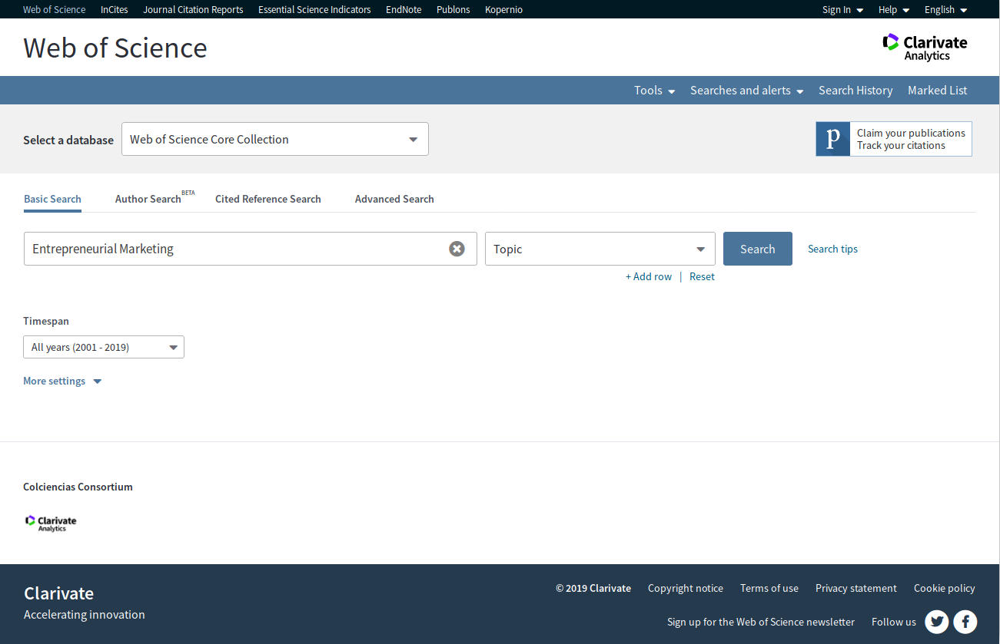
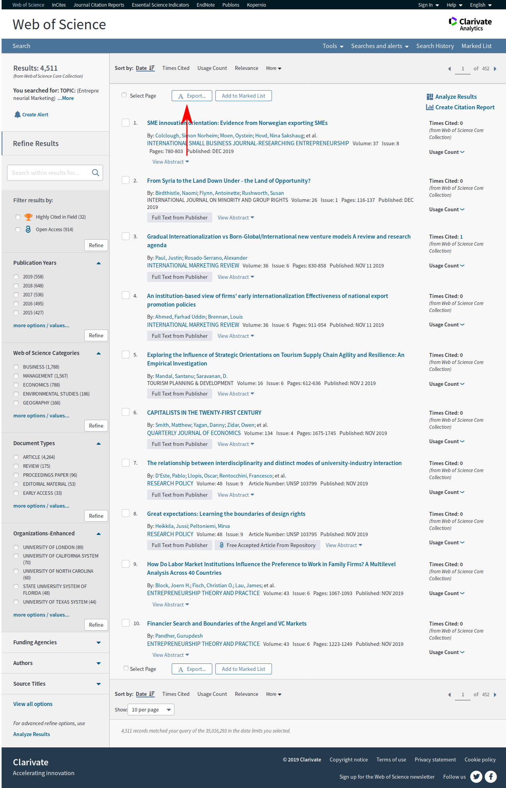
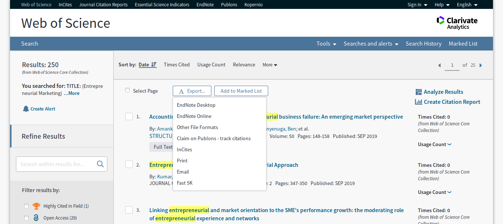
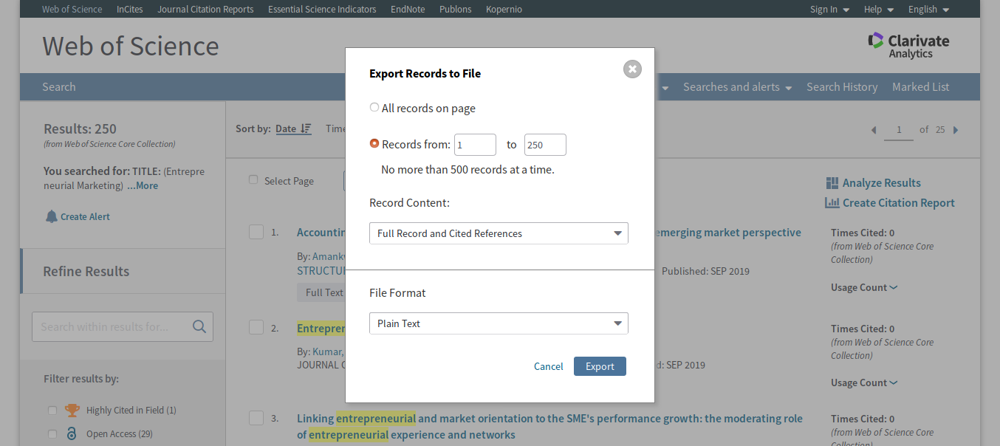
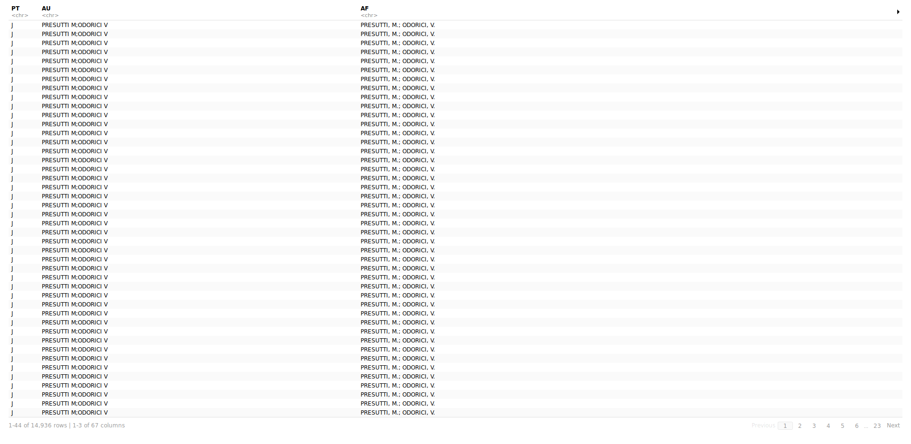

Open the page of [Web of Science](http://www.webofknowledge.com) in such a way that you can start a new search of an specific topic. if you belong to the National University of Colombia, you could sign in by this [page](https://login.ezproxy.unal.edu.co/login?url=http://www.webofknowledge.com).

In this project, we are going to work with a particulary topic, named **"Entrepreneurial Marketing"**



The search result is the follow



In this part, you have to choose the option **Other file formats**.



And in the box you are going to complete as the following box.



Now, you have the dataset to start to work [EM.txt](files/EM.txt).

The first thing that you have to do is read the dataset and [convert](https://cran.r-project.org/web/packages/bibliometrix/vignettes/bibliometrix-vignette.html) it into a dataframe:

**Input:**
```r
text <- readFiles("/cloud/project/data/EM.txt")
tos_dataframe <- convert2df(text, dbsource = "isi", format = "plaintext")
tos_dataframe$IDWOS <- rownames(tos_dataframe)

```

**Output:**

```
Converting your isi collection into a bibliographic dataframe

Articles extracted   100 
Articles extracted   200 
Articles extracted   244 
Done!


Generating affiliation field tag AU_UN from C1:  Done!
```

**Input:**
```r
tos_dataframe %>% 
  separate_rows(CR, sep = "; ")
```

**Output:**


