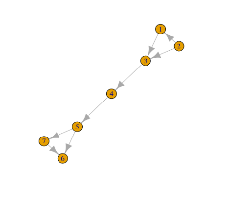
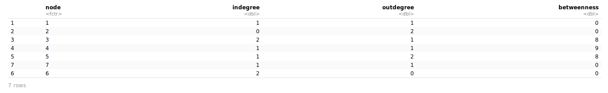

To star the first thing that we are going to do is to import the required libraries:

**Input:**

```r
library(tidyverse)
library(igraph)
```

Then, we have to upload the CSV dataset named [collection.csv](files/collection.csv) in the folder data.

First we are going to read the csv file with the edges.

**Input:**

```r
collections <- read_csv('/cloud/project/data/collection.csv')
```

**Output:**

```
Parsed with column specification:
cols(
  from = col_double(),
  to = col_double()
)
```

Then, we are going to compute the graph from our collection of edges.

**Input:**

```r
my_graph <- graph.data.frame(collections, directed = TRUE)
```

Summarize the properties and values of `my_graph`.

**Input:**

```r
summary(my_graph)
```

**Output:**

```
IGRAPH 3aa598f DN-- 7 8 --
+ attr: name (v/c)
```

See the graph, with the `plot()` function.

**Input:**

```r
plot(my_graph)
```

**Output:**



In order to compute the **degree of our graph**, we could use the function degree.

**Input:**

"In" degree:

```r
degree(graph = my_graph, mode = "in")
```

**Output:**

```
1 2 3 4 5 7 6
1 0 2 1 1 1 2
```

**Input:**

"Out" degree:

```r
degree(graph = my_graph, mode = "out")
```

**Output:**

```
1 2 3 4 5 7 6
1 2 1 1 2 1 0
```

**Input:**

"In/Out" degree:

```r
degree(graph = my_graph, mode = "all")
```

**Output:**

```
1 2 3 4 5 7 6
2 2 3 2 3 2 2
```

To compute the **betweenness centrality** of our graph, we should use the function betweenness.

**Input:**

```r
betweenness(graph = my_graph, directed = TRUE)
```

**Output:**

```
1 2 3 4 5 7 6
0 0 8 9 8 0 0
```

Now, we should create a dataframe with all the information about the degree and betweenness of our graph.

**Input:**

```r
my_data <- data.frame(node = V(my_graph)$name,
                      indegree = degree(my_graph, mode = "in"),
                      outdegree = degree(my_graph, mode = "out"),
                      bet = betweenness(my_graph, directed = TRUE))
```

**Output:**



In order to remove those vertices where the indegree is 1 and the outdegree is 0, we should compute a subset.

**Input:**

```r
my_subset <- subset(my_data,
                    !((my_data$indegree == 1) & (my_data$outdegree == 0)))
```

**Output:**

<div class="markdown-div-tables">
    <table>
        <thead>
            <tr>
                <td>node</td>
                <td>indegree</td>
                <td>outdegree</td>
                <td>betweenness</td>
            </tr>
        </thead>
        <tbody>
            <tr>
                <td>1</td> 
                <td>1</td> 
                <td>1</td>
                <td>0</td>
            </tr>
            <tr>
                <td>2</td>
                <td>0</td>
                <td>2</td>
                <td>0</td>
            </tr>
            <tr>
                <td>3</td>
                <td>2</td>
                <td>1</td>
                <td>8</td>
            </tr>
            <tr>
                <td>4</td>
                <td>1</td>
                <td>1</td>
               <td>9</td>
            </tr>
            <tr>
                <td>5</td>
                <td>1</td>
                <td>2</td>
                <td>8</td>
            </tr>
            <tr>
                <td>7</td>
                <td>1</td>
                <td>1</td>
                <td>0</td>
            </tr>
            <tr>
                <td>6</td>
                <td>2</td>
                <td>0</td>
                <td>0</td>
            </tr>
        </tbody>
    </table>
</div>

According to the previous exercises, at this point it'll be possible to create the ToS algorithm.

- Step 1: read.

  ```r
  text <- readFiles("/cloud/project/data/EM.txt")
  dataframe <- convert2df(text, dbsource = "isi", format = "plaintext")
  dataframe$IDWOS <- rownames(dataframe)
  ```

- Step 2: split.

  ```r
  dataframe_splitted  <- dataframe %>% separate_rows(CR, sep = "; ")
  ```

- Step 3: change the format.

  ```r
  dataframe_formated <- dataframe_splitted %>% mutate(IDWOS2 = paste(IDWOS, sep = ", ",
                                                                      paste("V",sep="",VL),
                                                                      paste("P",sep="",BP),
                                                                      paste("DOI ",sep="",DI)))
  ```

- Step 4: compute the graph.

  ```r
  edges <- dataframe_formated[!is.na(dataframe_formated$CR),c("IDWOS2", "CR")]
  tos_graph <-graph.data.frame(edges, directed = TRUE)

  ```

- Step 5: clean the graph.

  ```r
  tos_graph_cleaned <- data.frame(node = V(graph = tos_graph)$name,
          indegree = degree(graph = tos_graph, mode = 'in'),
          outdegree = degree(graph = tos_graph, mode = 'out'),
          betweenness = betweenness(graph = tos_graph, directed = TRUE))

  tos_cleaned <- subset(tos_graph_cleaned,
                      !((tos_graph_cleaned$indegree == 1) & (tos_graph_cleaned$outdegree== 0)))
  ```
